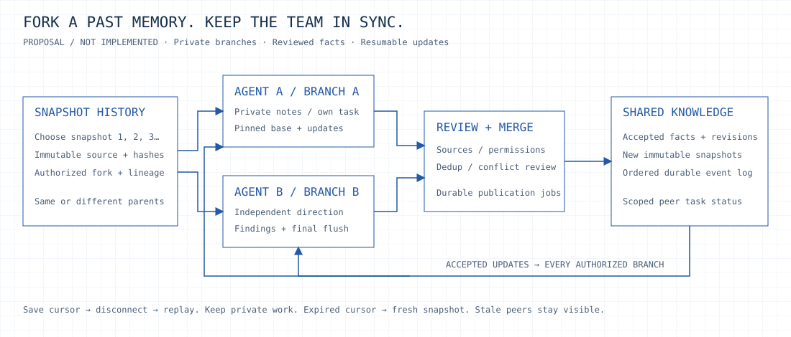

<p align="center"></p>

<p align="center">
<a href="https://github.com/maskjelly/instantKV/actions/workflows/ci.yml"></a>
<a href="LICENSE"></a>

</p>

# instantKV

[Website](https://instantkv.com) · [Start guide](https://instantkv.com/docs/quickstart/)
· [Memory demo](https://instantkv.com/demo/) · [Benchmarks](https://instantkv.com/benchmarks/) · [Documentation](https://instantkv.com/docs/)

**Your agent did the work. Give it somewhere to keep it.**

instantKV stores the facts and unfinished work your agents need after compaction
or a restart. Save a decision under a key like `project/storage`. Save a checkpoint
with the goal and next step. When the agent returns, load that checkpoint and
fetch the details it needs.

Run it on your own machine or VPS. Give the swarm shared project knowledge and
each agent a private namespace: a section of storage with its own permissions.
Workers can read the shared facts while keeping their notes and checkpoints separate.

One Rust binary. No model calls to store or retrieve memory. Connect through HTTP,
the CLI, or seven MCP tools. The software is MIT licensed; you pay for the machine
and its upkeep.

## Who it's for

- Coding agents that need to keep decisions and pick up unfinished tasks.
- Cloud workers that restart or regularly run out of context.
- Swarms that share project facts but need separate working notes.
- Developers who want to add memory to an agent runtime they already use.

You choose what to save and how to name it. Retrieval uses exact keys or prefixes;
semantic search and automatic memory extraction are future work.
[How instantKV compares with other memory tools →](docs/choosing-instantkv.md)

## The swarm memory model


Working today: agents read shared knowledge, write their own notes and save durable
checkpoints. Each request checks that worker's permissions. Add namespaces and
credentials for more agents. All workers use one server today; independent replicas
and automatic consolidation are planned below.
[Cloud-agent setup and permissions →](docs/cloud-agents.md)

## Start using it

With Docker and Compose, on a fresh checkout and volume:

```sh
git clone https://github.com/maskjelly/instantKV.git
cd instantKV
INSTANTKV_PROFILE=swarm ./scripts/quickstart.sh
./scripts/kv.sh put shared project/storage --value '{"content":"Use Rust + redb"}'
./scripts/kv.sh get shared project/storage
./scripts/kv.sh demo --swarm
```

Or install with Rust 1.98+:

```sh
cargo install --git https://github.com/maskjelly/instantKV --locked instantkv
instantkv init --profile swarm
instantkv serve
# In another terminal, in the same directory:
instantkv put shared project/storage --value '{"content":"Use Rust + redb"}'
instantkv get shared project/storage
```

Setup generates private credentials automatically. The commands above use the
operator credential; give each worker only its scoped token through its secret
store. Docker retains the database in a named volume. Existing setups keep their
original profile. [Quick setup and binary install →](docs/quickstart.md)

## See it work

[**Open the memory demo →**](https://instantkv.com/demo/)
Replay 100,000 real Mac cache writes at 2× animation speed, then recall a cached
storage response. The measured result stays **42,517 writes/s**, with **0.328 ms
PUT p50**; playback never scales performance numbers. Three runs per mode,
330,000 writes and 24 exact reads, zero errors.
[Mac hardware, limits and all raw reports](docs/demo-results/2026-10-02-mac/README.md).

Select **Live VPS** to write up to 100,000 temporary cache records or 10,000 durable records. Clear the
writer's local context, retrieve an exact key in the separate reader, or open the
reader in a new tab. The demo uses real Rust storage and shows how many records
were saved, how much data was written and how long requests took. Watch throughput,
latency percentiles and the live request trace. Replay is labeled separately
from live storage; no account needed.


[Demo architecture and measurement boundaries](docs/live-demo.md).
For durable compaction handoffs and restart verification:

```sh
instantkv demo --swarm
# Or: ./scripts/kv.sh demo --swarm
```

The demo starts its own server and two clients with separate credentials. Both
read shared facts; each writes private notes. It checks that a worker can't read
the other's notes or overwrite shared facts. Then it saves Alpha's checkpoint,
clears simulated context, kills the server and restores from the same database.
No model API key is needed.
[Demo walkthrough and example output →](docs/demo.md)

## Survive compaction


Save the goal, constraints, decisions, unfinished tasks and next action in a
checkpoint. Its short context note is called a `capsule` in the API. Keep detailed
facts in separate records and refer to them by key and revision.

Wait until the save succeeds. Keep the checkpoint ID outside the prompt so
compaction can't erase it. After compaction, load the checkpoint first, then
fetch the records it points to.
[Connect your agent through MCP →](docs/agents.md)

## Three kinds of memory

| Namespace type | Purpose | Restart behavior |
|---|---|---|
| Shared + private knowledge | Facts, decisions, sources; exact key recall | Durable; no default TTL |
| Private checkpoints | Immutable capsules and atomic session latest pointers | Durable; never auto-evicted |
| Optional scratch | Temporary working data | RAM; TTL and FIFO eviction |

The swarm profile ships `shared`, `alpha`, `beta`, and a checkpoint namespace for
each worker. Default `instantkv init` gives a single agent `knowledge`,
`checkpoints`, and `scratch`. All namespace names and quotas are configurable.

- **Safe handoff:** capsule + latest pointer + quota counters commit together.
- **Small restores:** essential context inline; versioned references fetched on demand.
- **Controlled sharing:** per-namespace permissions and conditional revision writes.
- **Bounded storage:** quotas, size/TTL limits, indexed expiry and admission limits.
- **Agent access:** seven typed MCP tools; HTTP and CLI use the same policies.

## Architecture


**Rust + Tokio + Axum + redb.** Rust suits the bounded storage and concurrency
core; redb supplies durable transactions without a separate database service.
[Design and schema](docs/architecture.md) · [Configuration](docs/configuration.md)
· [API contract](docs/agent-memory.md) · [Engineering inspirations](docs/inspirations.md)

## Measure it

Against the running Docker swarm instance:

```sh
./scripts/kv.sh bench --namespace alpha --operation get --requests 5000 --concurrency 16
./scripts/kv.sh bench --namespace alpha --operation put --requests 1000 --concurrency 8
```

Real HTTP keep-alive requests; reports throughput, p50/p95/p99, and errors.
Durable writes keep immediate durability enabled. Checkpoint benchmarks should
use a disposable instance. [Workloads and recorded results →](docs/benchmarks.md)

The original single-agent profile was measured on a busy shared 4-vCPU VPS;
medians of three runs, zero errors:

| Operation | Successful req/s | p50 / p99 |
|---|---:|---:|
| Scratch GET, 512 bytes | 3,708 | 1.88 / 47.36 ms |
| Durable PUT, 512 bytes | 744 | 5.80 / 57.65 ms |
| Capsule restore | 3,324 | 2.24 / 48.54 ms |

These loopback measurements include existing host load. They do not measure
public HTTPS or distributed swarms. Raw reports and environment are linked above.

## Next: distributed knowledge consolidation


The plan is to fork past memory snapshots into independent agent branches. Give
several agents the same starting point and let them explore different directions.
They keep private notes, share findings during their runs and follow accepted
updates from the shared knowledge base. A scoped activity feed shows what other
agents are working on and which updates they have seen. Sources and conflicts
are reviewed before findings become shared facts; completion flushes the remaining
changes. Offline agents catch up from a saved cursor.



We'll measure useful knowledge by checked facts, source coverage and recall
success, with freshness and unresolved conflicts visible. Storing more text alone
doesn't show improvement. This distributed workflow is a proposal.
[Detailed design, schema and rollout gates →](docs/distributed-memory.md)

## Project status

Early single-node release. Shared knowledge and private agent namespaces work today. Physical
replication, automatic consolidation, semantic search and automatic runtime
compaction hooks remain future work. The restart demo simulates context clearing;
a real-model lifecycle evaluation and deeper power/disk-failure audit remain open.
[Implemented and next](docs/roadmap.md) · [Operations and backup](docs/operations.md)

Here, KV means keys and values for agent knowledge. An inference KV cache stores
a model's attention tensors; those stay in the model runtime.

## Contribute

[Development guide](CONTRIBUTING.md) · [Security reports](SECURITY.md)
· [Changelog](CHANGELOG.md) · [Verified checkpoints](docs/checkpoints.md)
· [Session request audit](docs/request-audit.md)

MIT licensed. Original Monolith identity, four diagrams and matching editable sources:
[docs/assets](docs/assets/README.md).
