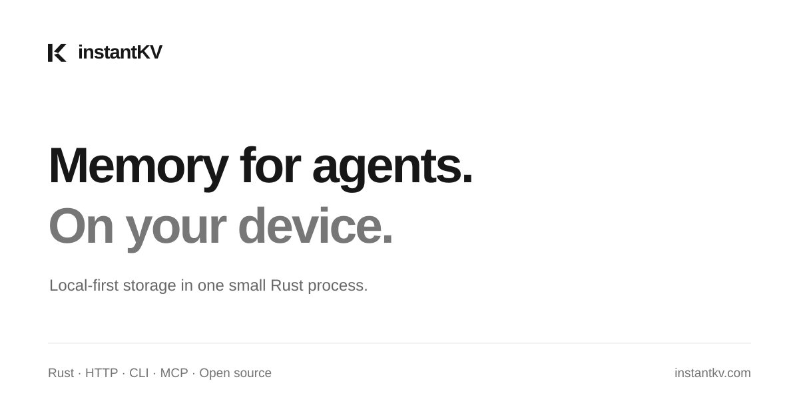
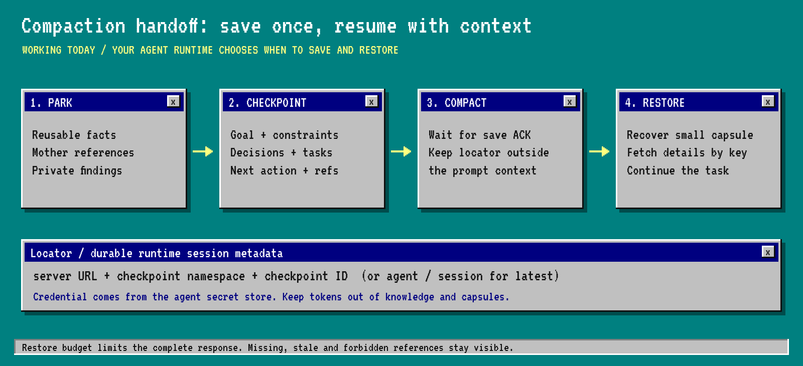

<p align="center"></p>

<p align="center">
<a href="https://github.com/maskjelly/instantKV/actions/workflows/ci.yml"></a>
<a href="LICENSE"></a>

</p>

# instantKV

**Local memory for AI agents. One Rust binary. No cloud dependency.**

Save facts, preferences and task state on your device. Find memories by topic,
tag, time or keywords. Rank documents with BM25 search. Keep them across sessions and server restarts.
Your runtime chooses what to save and adds retrieved facts to the model context.
Storage and retrieval work offline after installation.

[Website](https://instantkv.com) · [Memory guide](docs/memory-mvp.md) ·
[Quick start](docs/quickstart.md) · [Demo](https://instantkv.com/demo/) · [Roadmap](docs/roadmap.md)

**Source MVP, unreleased.** Build from source for the new memory tools.
Older release archives contain the original KV and checkpoint tools.
Native phone integration is planned.

## Start locally

From this checkout, with Rust 1.98 or later:

```sh
cargo install --path crates/instantkv --locked
mkdir my-local-memory
cd my-local-memory
instantkv init
instantkv serve
```

Open another terminal in the same directory:

```sh
instantkv remember "Prefer Rust for local tools" --key preferences/language --topic preferences --tag local
instantkv recall --topic preferences --query Rust
instantkv search "preferred language for local tooling" --limit 10
instantkv browse --limit 10
instantkv forget preferences/language
```

Setup creates private credentials and stores data in `.instantkv/data`.
The server listens on `127.0.0.1:8080`. Installation can download dependencies;
the running memory service needs no account, model API or embedding service.

[Docker setup](docs/quickstart.md#docker-is-optional) · [Connect through MCP](docs/agents.md)

## What you get

| Feature             | Behavior                                                                |
| ------------------- | ----------------------------------------------------------------------- |
| Five memory tools   | `remember`, `recall`, `search`, `browse`, `forget`                      |
| Structured records  | Content, topic, tags, event time and custom JSON metadata               |
| Indexed retrieval   | Topic/tag/time indexes, literal filters and bounded BM25 relevance ranking |
| Task checkpoints    | Save the goal and next action before a context reset; restore afterward |
| Private namespaces  | Share project facts while each agent keeps separate notes               |
| Configurable limits | Storage quotas, expiry, request limits and query budgets                |
| Integration         | HTTP, CLI, twelve MCP tools or an embedded Rust core                    |

`search` ranks content with English stemming and OR terms. `recall --query` applies literal AND filters.
Check `truncated` on ranked results. Embedding search and automatic extraction remain planned.
Records and indexes change in one redb transaction, including updates, deletion and expiry cleanup.

[API and limits](docs/memory-mvp.md) · [HTTP](docs/http.md) · [CLI](docs/cli.md)

## Measured performance

**Document recall:** 81.43% Recall@10 on BEIR SciFact, versus 74.80% for
Supermemory local v0.0.8 with bge-base embeddings and no reranker.
Ranked query p95: 1.31 ms. One Mac run, 5,183 documents, 300 judged queries.
Both systems used fresh databases in sequential same-host runs. This is a scoped retrieval
result, not an agent-quality or phone benchmark.
[Full comparison, costs and raw data](docs/benchmarks/2026-10-03-ranked/README.md).

Apple M4 Pro, 24 GiB memory, macOS 27.0. Three fresh databases, 10,000 memories per run,
512-byte content plus metadata. Warm, sequential loopback HTTP; concurrency one.

| Measurement                          | Result across three runs  |
| ------------------------------------ | ------------------------- |
| Native binary                        | 8.28 MiB |
| Idle server RSS                      | 6.34–6.36 MiB |
| Largest sampled server RSS           | 20.91 MiB |
| Topic query p95                      | 0.130–0.137 ms |
| Durable save p95                     | 6.051–6.382 ms |
| Exact recovery after abrupt restarts | 30,000 of 30,000 memories |

p95 is the time within which 95% of measured operations complete.
RSS is the process memory reported by the operating system. Samples do not measure peak RAM.
RAM samples cover the Rust server. Latencies include the local HTTP client and server.
The results exclude model inference, phone performance and battery use.
The browser demo uses the same memory API. Live mode saves, filters, browses and deletes real memories.
Recorded mode shows verified responses from three fresh 10,000-memory runs.

[Full workload and reproduction](docs/performance.md) ·
[Raw report](docs/benchmarks/2026-10-03-ranked/mac-arm64.json) · [Benchmark methodology](docs/benchmarks.md)

## Small by default

The local profile uses an 8 MiB redb cache, 4 MiB scratch quota and 32 active requests.
Durable knowledge has a 64 MiB logical quota and a 10,000-record limit.
These are component limits, not a total RAM or disk cap.

Scratch uses RAM and expiry; it is empty after a restart.
Durable knowledge and checkpoints remain in the database. Full durable namespaces reject writes.

Use `init --profile swarm` for shared facts and private worker namespaces.
Use `init --profile agent` for larger quotas.
[Configuration](docs/configuration.md) · [Local use and device support](docs/local-first.md)

## Continue work after a context reset

Save a checkpoint before clearing context. Wait for success, then keep its locator outside the prompt.
Restore the checkpoint before continuing. Fetch detailed records as needed.
The checkpoint and the session's latest pointer commit together.



Try the memory tools, including ranked search, across a real restart, then test agent isolation:

```sh
instantkv demo
instantkv demo --swarm
```

It uses real HTTP and a real restart, with separate worker credentials.
Context clearing is simulated; real model-quality evaluation is pending.
[Swarm setup](docs/cloud-agents.md) · [Checkpoint contract](docs/agent-memory.md) · [Backup guide](docs/operations.md)

## Next steps

| Priority           | Planned work                                                                                |
| ------------------ | ------------------------------------------------------------------------------------------- |
| Real local agents  | Evaluate preferences and task continuation with the [Ollama example](examples/local-llm.py) |
| ARM devices        | Measure latency, RSS and recovery on a named Linux ARM64 board                              |
| Native phones      | Add Swift/Kotlin bindings; test storage, lifecycle and battery use                          |
| Portable memory    | Add export, import and schema migration tools                                               |
| Retrieval quality  | Evaluate more corpora, real-agent tasks and optional local embeddings                       |

Linux x86_64, Linux ARM64 and macOS ARM64 passed [source MVP CI](https://github.com/maskjelly/instantKV/actions/runs/37138251395).
Physical ARM-board measurements and native phone support remain pending.

Initial ARM-board goals: indexed recall p95 ≤5 ms, durable save p95 ≤20 ms,
idle RSS ≤12 MiB and loaded RSS ≤32 MiB. These are unverified targets for the
[defined 10,000-memory workload](docs/performance.md#next-device-targets--not-yet-measured).

Independent replicas, shared-update review and managed hosting remain optional future work.
[Roadmap](docs/roadmap.md) · [Distributed proposal](docs/distributed-memory.md)

## Build and contribute

Rust + Tokio + Axum + redb. MIT license.
KV means keys and values for agent knowledge; the model's inference KV cache stays in its runtime.

[Architecture](docs/architecture.md) · [Contributor guide](CONTRIBUTING.md) ·
[Security](SECURITY.md) · [Changelog](CHANGELOG.md) · [Verification history](docs/checkpoints.md)
