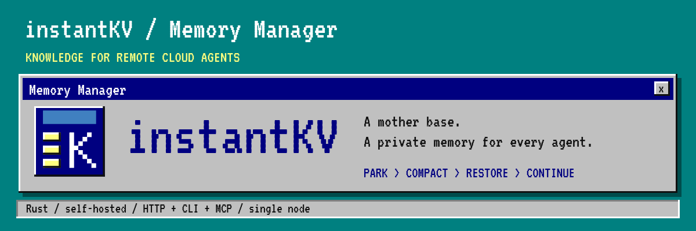
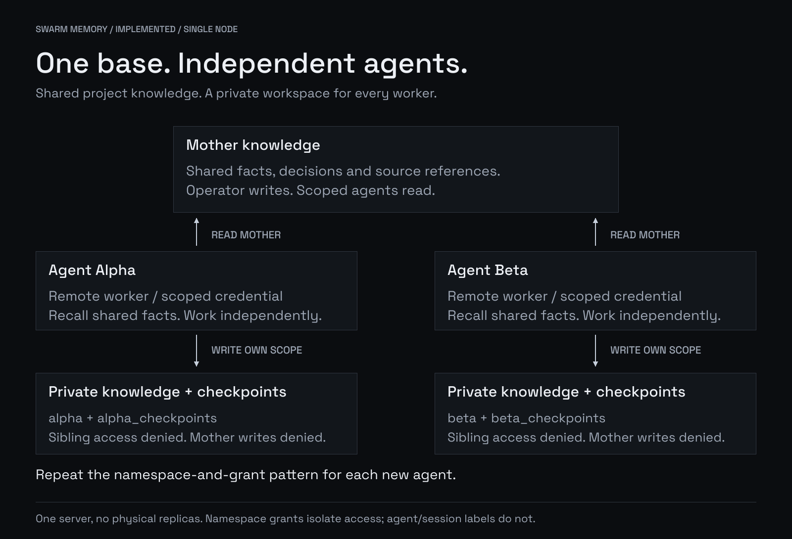
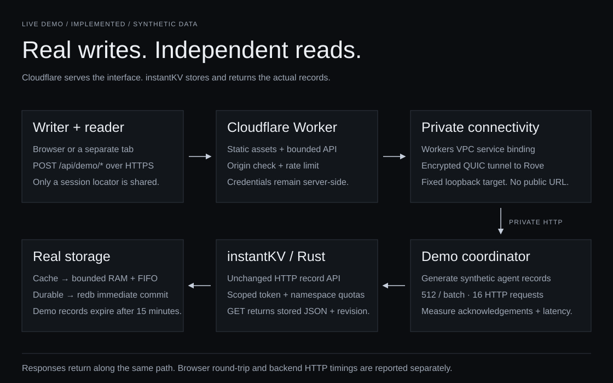
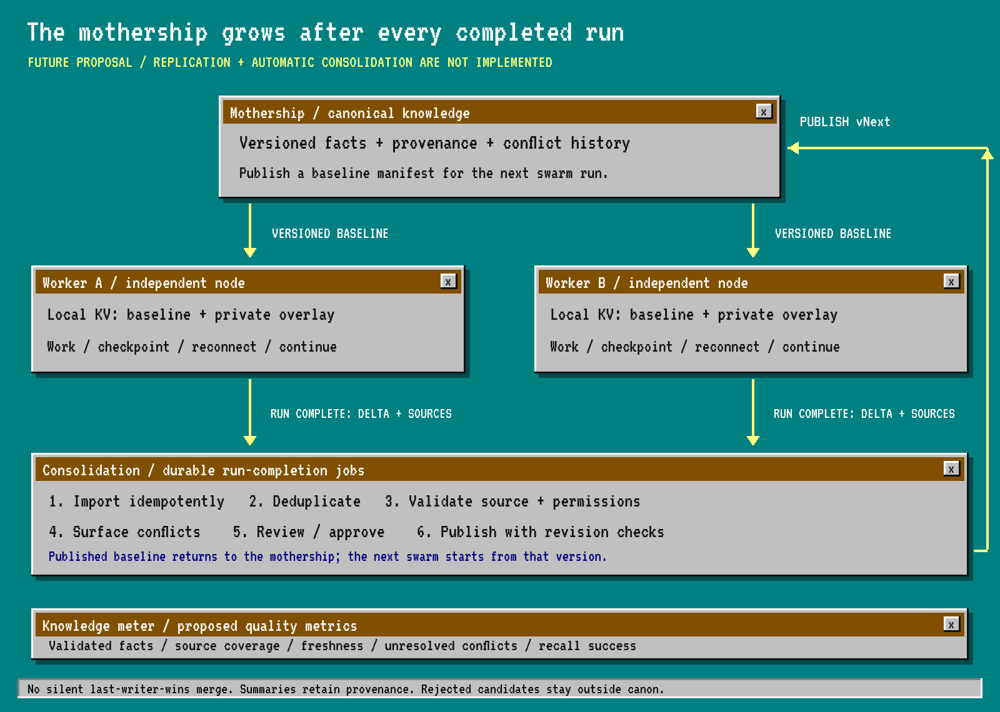

<p align="center"></p>

<p align="center">
<a href="https://github.com/maskjelly/instantKV/actions/workflows/ci.yml"></a>
<a href="LICENSE"></a>

</p>

# instantKV

[Website](https://instantkv.com) · [Start guide](https://instantkv.com/docs/quickstart/)
· [Live demo](https://instantkv.com/demo/) · [Benchmarks](https://instantkv.com/benchmarks/) · [Documentation](https://instantkv.com/docs/)

**A shared knowledge base for cloud agents. A private namespace for every worker.**

Remote agents need somewhere to keep project facts, decisions, and unfinished
work when their context gets compacted. instantKV is a self-hosted knowledge KV
service for that handoff: store knowledge, save a checkpoint, restore, and continue.

Give your swarm a **shared knowledge base** and give each agent its own knowledge
and checkpoint namespaces. Workers read the same project knowledge, work
independently, and keep their findings private. One Rust binary, one config,
one data directory. HTTP, CLI, and MCP share the same permission checks.

## The swarm memory model



**Working today:** shared knowledge reads, private agent writes, durable checkpoints,
and access checks on every request. Add namespaces and scoped credentials to
repeat the pattern for more agents. The shared knowledge base is live; independent
physical replicas and automatic consolidation are planned below.
[Cloud-agent setup and permissions →](docs/cloud-agents.md)

## Start using it

With Docker and Compose, on a fresh checkout and volume:

```sh
git clone https://github.com/maskjelly/instantKV.git
cd instantKV
INSTANTKV_PROFILE=swarm ./scripts/quickstart.sh
./scripts/kv.sh put shared project/storage --value '{"content":"Use Rust + redb"}'
./scripts/kv.sh get shared project/storage
./scripts/kv.sh demo --swarm
```

Or install with Rust 1.98+:

```sh
cargo install --git https://github.com/maskjelly/instantKV --locked instantkv
instantkv init --profile swarm
instantkv serve
# In another terminal, in the same directory:
instantkv put shared project/storage --value '{"content":"Use Rust + redb"}'
instantkv get shared project/storage
```

Setup generates private credentials automatically. The commands above use the
operator credential; give each worker only its scoped token through its secret
store. Docker retains the database in a named volume. Existing setups keep their
original profile. [Quick setup and binary install →](docs/quickstart.md)

## See it work

[**Open the live memory demo →**](https://instantkv.com/demo/)
Write up to 100,000 temporary cache records or 10,000 durable records. Clear the
writer's local context, retrieve an exact key in the separate reader, or open the
reader in a new tab. Real Rust storage, acknowledged progress, payload size,
throughput, latency percentiles and a live request trace. No account needed.



[Demo architecture and measurement boundaries](docs/live-demo.md).
For durable compaction handoffs and restart verification:

```sh
instantkv demo --swarm
# Or: ./scripts/kv.sh demo --swarm
```

The demo starts an isolated server and two scoped clients. It proves shared
recall, private writes, forbidden cross-agent reads and shared writes, then saves
Alpha's capsule, clears simulated context, kills the server and restores from
the same database. No model API key is needed.
[Demo walkthrough and example output →](docs/demo.md)

## Survive compaction


Save the goal, constraints, decisions, open tasks, next action, and versioned
knowledge references in a capsule. Wait for the durable acknowledgement, then
keep its locator in the runtime's session metadata. After compaction, restore
the capsule first and recall detailed records as needed.
[Connect your agent through MCP →](docs/agents.md)

## Three kinds of memory

| Namespace type | Purpose | Restart behavior |
|---|---|---|
| Shared + private knowledge | Facts, decisions, sources; exact key recall | Durable; no default TTL |
| Private checkpoints | Immutable capsules and atomic session latest pointers | Durable; never auto-evicted |
| Optional scratch | Temporary working data | RAM; TTL and FIFO eviction |

The swarm profile ships `shared`, `alpha`, `beta`, and a checkpoint namespace for
each worker. Default `instantkv init` gives a single agent `knowledge`,
`checkpoints`, and `scratch`. All namespace names and quotas are configurable.

- **Safe handoff:** capsule + latest pointer + quota counters commit together.
- **Small restores:** essential context inline; versioned references fetched on demand.
- **Controlled sharing:** per-namespace permissions and conditional revision writes.
- **Bounded storage:** quotas, size/TTL limits, indexed expiry and admission limits.
- **Agent access:** seven typed MCP tools; HTTP and CLI use the same policies.

## Architecture


**Rust + Tokio + Axum + redb.** Rust suits the bounded storage and concurrency
core; redb supplies durable transactions without a separate database service.
[Design and schema](docs/architecture.md) · [Configuration](docs/configuration.md)
· [API contract](docs/agent-memory.md) · [Engineering inspirations](docs/inspirations.md)

## Measure it

Against the running Docker swarm instance:

```sh
./scripts/kv.sh bench --namespace alpha --operation get --requests 5000 --concurrency 16
./scripts/kv.sh bench --namespace alpha --operation put --requests 1000 --concurrency 8
```

Real HTTP keep-alive requests; reports throughput, p50/p95/p99, and errors.
Durable writes keep immediate durability enabled. Checkpoint benchmarks should
use a disposable instance. [Workloads and recorded results →](docs/benchmarks.md)

The original single-agent profile was measured on a busy shared 4-vCPU VPS;
medians of three runs, zero errors:

| Operation | Successful req/s | p50 / p99 |
|---|---:|---:|
| Scratch GET, 512 bytes | 3,708 | 1.88 / 47.36 ms |
| Durable PUT, 512 bytes | 744 | 5.80 / 57.65 ms |
| Capsule restore | 3,324 | 2.24 / 48.54 ms |

These loopback measurements include existing host load. They do not measure
public HTTPS or distributed swarms. Raw reports and environment are linked above.

## Next: distributed knowledge consolidation



The direction: each cloud agent receives a versioned knowledge baseline, runs
with its own local KV and private overlay, and submits shareable findings when
its run ends. A consolidation pipeline deduplicates, validates, compacts and reviews those
findings before publishing the next baseline for the swarm.

The **knowledge quality metrics** should track validated facts, source coverage, freshness,
unresolved conflicts and recall success. More stored tokens alone do not mean
better knowledge. **This distributed workflow is a proposal, not shipped behavior.**
[Detailed design, schema and rollout gates →](docs/distributed-memory.md)

## Project status

Early single-node release. Shared knowledge and private agent namespaces work today. Physical
replication, automatic consolidation, semantic search and automatic runtime
compaction hooks remain future work. The restart demo simulates context clearing;
a real-model lifecycle evaluation and deeper power/disk-failure audit remain open.
[Implemented and next](docs/roadmap.md) · [Operations and backup](docs/operations.md)

Stores application knowledge and compaction context; model attention tensors
remain with the inference runtime.

## Contribute

[Development guide](CONTRIBUTING.md) · [Security reports](SECURITY.md)
· [Changelog](CHANGELOG.md) · [Verified checkpoints](docs/checkpoints.md)
· [Session request audit](docs/request-audit.md)

MIT licensed. Original Monolith identity, four diagrams and matching editable sources:
[docs/assets](docs/assets/README.md).
