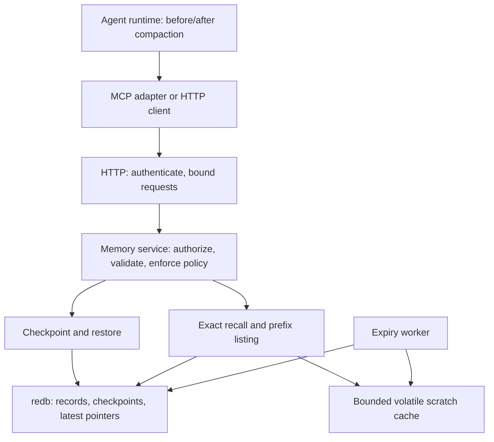

# instantKV architecture

**Status:** proposed design, 2026-10-01. For the engineer building the first release.
Only configuration and its validator are implemented.

## Decision

Build a **single-node Rust agent-memory server**. Durable knowledge is the default;
temporary working data uses a separate, bounded memory cache. Expose exact recall,
prefix discovery, checkpoint, and restore through HTTP and then MCP tools.

The product advantage is a dependable compaction handoff with deployment policies.
Raw GET throughput alone does not establish that agents can resume correctly.

## Stack

| Component | Choice | Reason / trade-off |
|---|---|---|
| Language | Rust, edition 2024 | Memory control and concurrency checks; higher implementation effort than Go |
| Network | Tokio + Axum + Tower | HTTP routing, bounded concurrency, timeouts, tracing |
| Durable engine | redb | Pure Rust, embedded transactional storage; one writer limits write scaling |
| Temporary cache | HashMap + per-namespace lock | Simple atomic quota checks; shard only after contention measurements |
| Deployment policy | Serde + TOML | Human-readable, strict, versioned config |
| Agent integration | MCP Rust SDK, stdio adapter first | Tool access for compatible clients; adapter calls authenticated HTTP |
| Operations | tracing, Prometheus metrics | Latency, rejected writes, expiry lag, checkpoint failures |
| Verification | Fake clock, proptest, Criterion, Rust load client | Deterministic expiry and invariants; measured latency and throughput |
| Deployment | Binary or Docker + persistent volume; Caddy for TLS | One process, no database service; Linux release image after server exists |

Dependencies are added when their milestone starts. Today Cargo includes only
Serde, TOML, and Clap. Commit Cargo.lock and build with `--locked`.

Rust is my recommendation for this system, not a claim that it is automatically
faster. Go is a reasonable alternative if delivery speed is the priority; its GC
adds another memory/latency tuning variable. TypeScript fits a future dashboard.
Using an existing Redis/Valkey server is the quickest route if the goal becomes
shipping an agent integration rather than building the storage service. RocksDB
is a candidate if measured durable write workloads exceed redb's capacity.

These choices are engineering judgments informed by [Rust's design](https://doc.rust-lang.org/book/ch00-00-introduction.html),
[Go's GC guide](https://go.dev/doc/gc-guide), [Axum's middleware integration](https://docs.rs/axum/latest/axum/),
and [redb's concurrency model](https://docs.rs/redb/latest/redb/struct.Database.html).

## Boundaries

- `instantkv-core`: config now; record model, policy, storage, checkpoint service later.
- `instantkv`: CLI now; HTTP routes and server lifecycle later.
- Future MCP adapter: protocol translation, using the same authenticated HTTP API.
- Agent runtime: decides what to preserve, when to checkpoint, and what to inject
  after compaction. Save a small bootstrap locator outside compacted conversation.

Store server-generated revisions, timestamps, and expiry metadata separately from
agent-supplied content. Namespaces are the authorization boundary; an `agent_id`
label inside a record grants no access rights. Separate namespaces/credentials
for private agents or projects; share namespaces only intentionally.

## Write and read paths

**Write:** authenticate → namespace/operation authorization → bounded body →
format/size/TTL validation → atomic quota + revision check → commit → response.
Invalid or over-quota writes preserve the old value. Conditional writes use the
current ETag; competing writers receive a conflict rather than silently losing work.

**Read:** authorize → locate record → check expiry → return bytes + revision.
Prefix lists return bounded metadata pages; callers fetch detail only when needed.
No read extends TTL. No bulk transcript injection on restore.

## Durable state and checkpoints

- Tables: records keyed by `(namespace, key)`, expiry index ordered by deadline,
  namespace usage counters, immutable checkpoint bundles, session latest pointers.
- Record changes, expiry index changes, and usage counters commit together.
- Checkpoint bundle + latest pointer commit in **one transaction**. The bundle
  contains essential context inline; scratch memory is never required for restore.
- Retry the same checkpoint ID/payload idempotently. A conflicting payload or
  stale expected latest revision fails; parallel sessions cannot overwrite pointers.
- Only acknowledge durable writes after `Durability::Immediate` commit returns.
  redb documents this persistence boundary in its [durability API](https://docs.rs/redb/latest/redb/enum.Durability.html).
- Keep synchronous database work off Tokio's async workers: a bounded dedicated
  writer queue, bounded blocking readers, and overload rejection before submission.
  See [Tokio's blocking-task guidance](https://docs.rs/tokio/latest/tokio/task/fn.spawn_blocking.html).
- Timeout after submission can mean an unknown outcome; clients retry by ID or
  inspect revision. Dropping an HTTP request must not abandon an admitted commit.

## Retention, eviction, and accounting

- Durable records store absolute UTC expiry for recovery; memory records use a
  monotonic deadline. Clock jumps are a durable TTL limitation; monitor skew.
- An expired record is immediately unreadable. A bounded expiry-index sweep frees
  it later. Recheck identity/revision under the transaction or lock before deleting.
- Updating a record removes its old expiry entry; cleanup cannot delete replacements.
- Expired entries count toward quotas until removed. Admission may do bounded
  reclamation; if still full, reject rather than doing an unbounded sweep.
- Count stored key + value bytes, including checkpoint metadata/pointers. Use checked
  arithmetic. These quotas do not equal process RSS or database file size.
- Cache eviction is oldest insertion first, scoped to its namespace. Updating an
  existing live key does not change its place. Durable knowledge never auto-evicts.
- Disk pages can be reused after deletion; secure erasure is not promised. Disk
  capacity needs headroom for indexes, transaction pages, and maintenance.

## Access and failures

| Event | Required behavior |
|---|---|
| Bad config / missing or duplicate secret values | Refuse startup before binding |
| Unauthorized request | Deny before storage lookup; redact tokens/content from logs |
| Disk full / commit error | No success response; old checkpoint pointer remains usable |
| Process killed mid-checkpoint | Recover a complete old or new bundle, never a partial one |
| Queue saturated | Bounded rejection; do not allocate an unbounded backlog |
| Bad/stale memory | Return provenance and revision; caller chooses whether to trust it |
| Checkpoint save failed | Integration keeps current context and retries; does not compact voluntarily |

Use high-entropy API tokens supplied through environment/secrets files. Compare
fixed-size token digests in constant time and keep them out of logs. Disabled auth
is allowed only on loopback. HTTPS belongs at the reverse proxy for remote use.
Retrieved memory is data: it cannot override agent instructions or grant tool powers.
No cross-namespace access through references or MCP tool arguments.

## Release boundaries

First release: one node, exact keys, paginated prefixes, JSON memory envelopes,
conditional writes, atomic checkpoints, bounded restore, expiry, quotas, scoped auth.

Later: text/tag search when callers cannot identify keys; semantic search only
after measuring a real recall problem. Replication, Raft, custom WAL, Redis wire
compatibility, and a dashboard are separate projects after the first release.

Remaining choices: first agent runtime to integrate; representative memory sizes;
target hardware and latency budget. No performance numbers are claimed yet.
