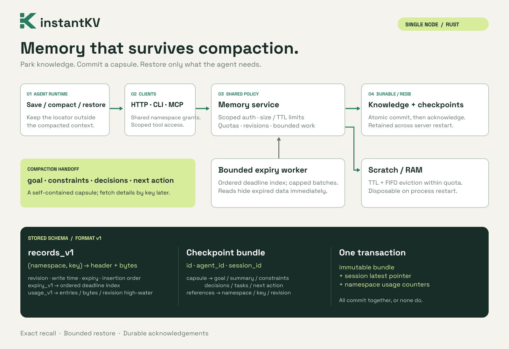

# Architecture and storage schema

Status: implemented single-node design, 2026-10-01. Future proposals are separated
below. See [verification history](checkpoints.md) for checks actually run.



## Stack decision

| Layer | Choice | Why / constraint |
|---|---|---|
| Core | Rust 2024, minimum Rust 1.98 | Ownership and explicit memory/concurrency bounds |
| HTTP | Tokio + Axum | Async networking, middleware, graceful shutdown |
| Durable storage | redb | Pure Rust, embedded ACID transactions; one writer |
| Scratch | Per-namespace Mutex + ordered maps | Atomic quotas; ordered prefix, deadline and FIFO indexes |
| Configuration | Serde + TOML | Strict fields and startup validation |
| Agent tools | Official rmcp SDK, stdio → HTTP | Same auth and policy as every client |
| Deployment | Binary / non-root Docker + volume | No database service or orchestration dependency |
| Verification | Fake-clock invariant tests + HTTP/MCP tests + CLI load client | Deterministic lifecycle checks and measured request paths |

Rust is a strong fit here. Go would also work; Rust trades development effort for
control over allocation and ownership. We use a database engine rather than
invent a WAL. Valkey would be a sensible backend for an integration-only product;
redb keeps this system embedded and self-contained. These are engineering choices,
not a claim that Rust automatically makes HTTP faster.

Sources: [Rust ownership](https://doc.rust-lang.org/book/ch04-00-understanding-ownership.html),
[Axum](https://docs.rs/axum/latest/axum/),
[redb concurrency](https://docs.rs/redb/latest/redb/struct.Database.html).

## Boundaries and request paths

`instantkv-core` owns policy, admission, clocks, quota accounting, storage and
checkpoint transactions. `instantkv` owns HTTP, authentication, CLI, MCP, demo
and benchmark workflows. Clients do not bypass the HTTP permission layer.

Write: authorization → bounded body → format/TTL/size checks → conditional
revision and quota checks → transaction or namespace lock → acknowledge.
A failed write preserves the old live value; admission may reclaim expired data.

Read: authorize → lookup → expiry check → bytes and revision. Lists return
metadata only, up to 1,000 items per page, with bounded scans. An extra empty page
is possible; follow `next_cursor` until null. Lists are not stable snapshots.

A semaphore bounds admitted requests and cleanup work. Synchronous storage runs
on `spawn_blocking`; a submitted task retains its permit even if the HTTP deadline
expires. There is no unbounded writer queue. A response timeout can have an unknown
write outcome: inspect revision or retry the same checkpoint ID and payload.
[Tokio blocking-task behavior](https://docs.rs/tokio/latest/tokio/task/fn.spawn_blocking.html)
explains why dropping the response does not cancel a running commit.

## Stored schema: format 1

All tables live in `instantkv.redb`. Integers in record/counter values are
little-endian u64. Namespace and ordinary keys prohibit NUL, so the composite key
is unambiguous.

| Table | Key | Value |
|---|---|---|
| `records_v1` | `namespace + NUL + key` | 32-byte header + raw value bytes |
| `usage_v1` | namespace | entry count, key/value bytes, revision high-water mark |
| `expiry_v1` | padded UTC deadline + revision + composite key | composite record key |
| `metadata_v1` | format / namespace identity | format version / storage mode + purpose |

Record header: revision, write time, expiry time (0 means absent), insertion order.
Ordinary JSON values have no mandatory application envelope; provenance is an
agent convention. Raw bytes and UTF-8 are configurable alternatives.

Checkpoint namespace reserved records:

```text
__checkpoint/<id>            -> JSON CheckpointRequest (immutable capsule + references)
__latest/<agent>/<session>    -> checkpoint ID bytes
```

Bundle, latest pointer, and usage updates share one redb write transaction.
`expected_latest_revision = null` means no prior pointer; subsequent saves use the
last acknowledged pointer revision. Identical ID/payload retries never rewind the
pointer. Old bundles can be explicitly deleted, but the current latest cannot.
IDs must remain unique: deletion removes the saved retry history.

redb's default immediate durability is retained. Success follows commit; guarantees
still depend on the filesystem and storage honoring synchronization. See
[redb durability](https://docs.rs/redb/latest/redb/enum.Durability.html).
Restore reads bundle and pointer in one snapshot. Reference status checks happen
separately and are advisory observations, not a snapshot of all referenced keys.

## Retention and accounting

Memory TTL uses a monotonic deadline; persisted TTL uses UTC and is sensitive to
wall-clock changes. Reads hide expired data immediately. Indexed cleanup has a
batch cap; expired entries count against quota until removed. Memory PUT also
runs a bounded cleanup batch. Durable admission does not perform a full sweep.

FIFO scratch eviction uses insertion order. Reads and live overwrites do not
reorder an entry; recreating an expired entry is a new insertion. Durable data
rejects over-quota writes and never auto-evicts. Revisions do not reset after
delete, so a stale conditional update cannot succeed after delete/recreate.

Quotas count stored key and value bytes, including checkpoint bundles/pointers.
They do not bound allocator overhead, RSS, indexes, or physical database size.
Disk pages may be reused after deletion; secure erasure is not provided.

## Access and operations

Namespaces are the isolation boundary. Agent/session labels are metadata.
Private agents need separate scopes; grants apply to reference lookup as well as
record access. Secrets are loaded at startup and compared as fixed-size hashes.
Disabled auth requires loopback. Remote access uses SSH tunneling or HTTPS at a
proxy. Logs avoid request bodies and tokens; metrics expose aggregate counters.

Health reports a running listener after successful startup validation/database
open; it is not a periodic storage write probe. Framework parsing rejections can
be plain text; service errors use a JSON error object. One process owns a data
file. [Operations](operations.md) covers backup and upgrade boundaries.

## Future proposals

1. Integrate a concrete runtime's compaction lifecycle and evaluate real task recall.
2. Add retired-session deletion, online backup, and deeper fault-injection tests.
3. Measure contention, expiry lag and memory growth before adding sharding or a
   dedicated write executor. Keep overload rejection bounded.
4. Add text/tag indexes only when exact keys and prefixes fail real retrieval tasks.
   Semantic search, replication, custom WAL and Redis protocol are separate work.
